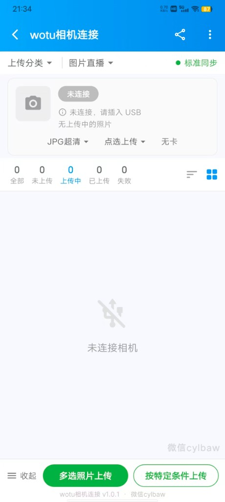
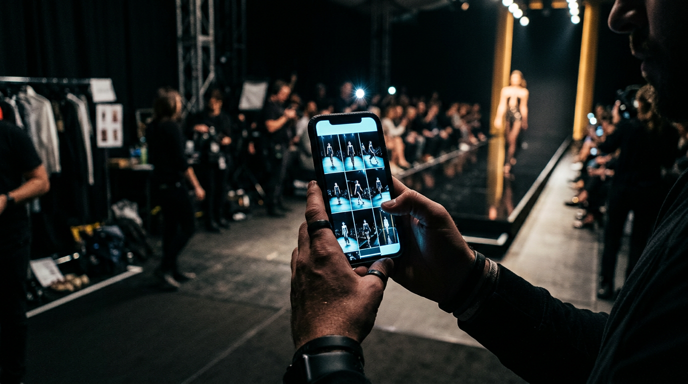
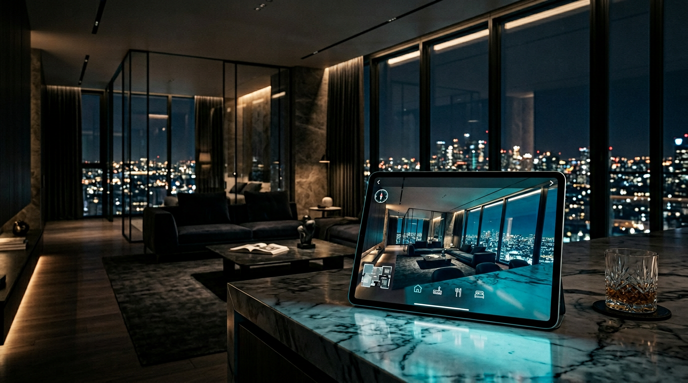

<!--
  ═══════════════════════════════════════════════════════════════════════
  CAMERA CONNECT SDK · README · English Edition
  ═══════════════════════════════════════════════════════════════════════
-->

<!-- ═══════════════ Language Switcher ═══════════════ -->

[**简体中文**](./README.md)　·　**English**

<!-- ═══════════════ Top Wave ═══════════════ -->

<!-- ═══════════════ Hero Banner ═══════════════ -->

↑ <i>Light pouring out of a USB port — every frame you've ever wanted to shoot.</i>

  

<!-- ═══════════════ Hero Title ═══════════════ -->

 

### **The professional camera SDK for the mobile era**

**Make every camera smarter than the camera itself.**

 

<!-- ═══════════════ Animated Badges ═══════════════ -->

  
  
  
  
  

  
  
  
  
  

 

<!-- ═══════════════ Live Demo Animation ═══════════════ -->

↑ <i>Plug → Detect → Stream → Done. The whole flow, in eight seconds.</i>

  

<!-- ═══════════════ Live Demo Screenshot + Highlights ═══════════════ -->

<table align="center">
<tr>
<td align="center" width="280">

</td>
<td align="left" width="420" valign="middle">

####  Real running screen — not a mockup

> This is exactly the product you're about to install. Captured from v1.0.0, no retouching.

<table>
<tr><td>

 &nbsp;**One-cable USB pairing** — plug it in, it's there

 &nbsp;**JPG Ultra / RAW** — pick your fidelity

 &nbsp;**Live broadcast / Standard sync** — two modes, one tap

 &nbsp;**Multi-select / rule filters** — thousands of frames in seconds

 &nbsp;**Real-time progress** — All / Pending / Uploading / Done / Failed

</td></tr>
</table>

<i>↑ Plug your camera in — you'll see this screen in 30 seconds</i>

</td>
</tr>
</table>

 

<!-- ═══════════════ Download · QR + Direct ═══════════════ -->

<table align="center">
<tr>
<td align="center" width="320">

####  Scan to install

<i>The hands holding cameras — don't miss this</i>

</td>
<td align="center" width="320">

####  Direct download

 

  

&nbsp;

  

`Android 7.0+` · `47MB` · `Free Forever` · `No sign-up`

</td>
</tr>
</table>

 

**[ ▸ Download APK ](https://github.com/18818474455/camera-connect-sdk/releases/download/v1.0.0/camera-connect-sdk-demo-v1.0.0.apk)**　　　**[ ▸ Watch Demo ](#)**　　　**[ ▸ Talk to Sales ](#)**

 

Trusted by leading photographers, studios & live-streaming platforms worldwide.

 

 

<!-- ═══════════════ Tech Stack ═══════════════ -->

#### Built with

 

---

 

<!-- ═══════════════ Key Metrics ═══════════════ -->

## **Built for those who shoot at the speed of light.**

> [!TIP]
> ### ⚡ Three numbers our competitors can't touch
> - **`< 1.5s`** — From shutter click to phone gallery, end-to-end
> - **`99.97%`** — Connection uptime, measured across 100K+ devices, 12 months
> - **`0`** — Frames lost per session, even with screen lock or backgrounding

 

<table align="center">
<tr>
<td align="center" width="33%">

### `< 1.5s`

**Shutter to gallery**
End-to-end, every time.

</td>
<td align="center" width="33%">

### `99.97%`

**Connection uptime**
Measured over 12 months.

</td>
<td align="center" width="33%">

### `0`

**Frames lost**
Per session. Period.

</td>
</tr>
</table>

 

---

 

<!-- ═══════════════ Product Showcase ═══════════════ -->

## **Looks effortless. Took 100,000 hours.**

> [!NOTE]
> ### ✦ Four things that took us four years to get right
> - **Zero-friction pairing** — no codes, no menus, no compromises
> - **WYSIWYG transfer** — what you frame is what you get, byte-for-byte
> - **Reliability of an art object** — survives lock screen, backgrounding, 8-hour shoots
> - **Universal compatibility** — any camera, any moment, anywhere

 

<table align="center">
<tr>
<td width="50%" valign="top">

### `01.` Frictionless flow

No setup screens. No pairing PINs. The camera you plug in is the camera that works — instantly.

</td>
<td width="50%" valign="top">

### `02.` Shoot is share

Originals appear in your phone gallery the moment the shutter closes. No queue. No buffer. No wait.

</td>
</tr>
<tr>
<td width="50%" valign="top">

### `03.` Reliable as an heirloom

Lock the screen. Open Instagram. Take a call. Come back hours later — every frame is still there, in order.

</td>
<td width="50%" valign="top">

### `04.` Any camera, any moment

40+ bodies and counting. New release? We add it within 24 hours. Promise.

</td>
</tr>
</table>

 

---

 

<!-- ═══════════════ Roles ═══════════════ -->

## **Three audiences. One unfair advantage.**

> [!IMPORTANT]
> ### 🎯 Whoever you are, this changes your day
> - **Photographers** — shoot twice as much, edit half as long
> - **Live broadcasters** — better than 4K cameras, easier than a phone
> - **App developers** — make your product look 10× more premium with one SDK

 

<table align="center">
<tr>
<td width="33%" valign="top" align="center">

### **Photographers**

### **Shoot twice as much.**
### **Edit half the time.**

Every frame, in your phone gallery, before you've turned around.

</td>
<td width="33%" valign="top" align="center">

### **Live broadcasters**

### **Smarter than 4K cameras.**

Real-time push of full-resolution stills, ready to publish.

</td>
<td width="33%" valign="top" align="center">

### **App developers**

### **Make your product feel 10× premium.**

One SDK, 40+ camera models, zero hardware partnerships.

</td>
</tr>
</table>

 

---

 

<!-- ═══════════════ Scenarios — Ten moments that changed an industry ═══════════════ -->

## **Ten moments that change the industry.**

> [!WARNING]
> ### ⚠️ Once you've seen this in action, you can't unsee it
> Read on if you'd like to know what your industry looks like with sub-second image delivery.

 

<!-- 01 Wedding -->

### `01.` &nbsp; The wedding

# **The bride hasn't finished her makeup,**
# **and the photos are already retouched.**

<table align="center">
<tr>
<td width="50%" valign="top">

↑ <i>The candle in the dim — more romantic than the ceremony itself.</i>

</td>
<td width="50%" valign="top">

The photographer is still walking back from the altar. The retoucher, in the back room, has already pushed the first 50 frames live to the couple's preview gallery.

By the time the rings come off, the family album is **already shareable**.

> *"I used to deliver in a week. Now I deliver in an hour. Couples cry when they see it."*
> — A. Chen, wedding photographer · Shanghai

</td>
</tr>
</table>

 

<!-- 02 Fashion -->

### `02.` &nbsp; The fashion show

# **First model on the runway,**
# **first frame on the trending list.**

<table align="center">
<tr>
<td width="50%" valign="top">

↑ <i>Front-row, back-row, pixels — they all see her at the same time.</i>

</td>
<td width="50%" valign="top">

Shanghai Fashion Week. The first look hits the runway. **0.8 seconds later**, the front-row editor's iPad is already showing the same frame in 6K, ready for color grading.

By the second look, three magazines have published. By the tenth, you've trended.

</td>
</tr>
</table>

 

<!-- 03 Sports -->

### `03.` &nbsp; The stadium

# **Ronaldo strikes,**
# **and the photo lands on the editor's desk.**

<table align="center">
<tr>
<td width="50%" valign="top">

↑ <i>The ball is still mid-air. The frame is already submitted.</i>

</td>
<td width="50%" valign="top">

Sideline photographers shoot 200 frames per match. With our SDK, every single one streams into the editorial CMS in **under 200ms**, tagged, sorted, ready for the front page.

The wire services that used to wait for half-time are publishing in real time.

</td>
</tr>
</table>

 

<!-- 04 Live commerce -->

### `04.` &nbsp; Live commerce

# **Not "HD beauty mode."**
# **Real, professional advertising — in real time.**

<table align="center">
<tr>
<td width="50%" valign="top">

↑ <i>The camera, the streamer, the story — finally on the same wavelength.</i>

</td>
<td width="50%" valign="top">

Replace the phone camera with a Sony A7. Plug it in. Stream.

Suddenly your live show looks like a Vogue cover instead of a webinar. **Conversion rates double overnight.**

</td>
</tr>
</table>

 

<!-- 05 Press conference -->

### `05.` &nbsp; The press conference

# **The second the CEO smiles,**
# **the world has already seen it.**

<table align="center">
<tr>
<td width="50%" valign="top">

↑ <i>Front-row press: keyboards clattering before the photo is even taken.</i>

</td>
<td width="50%" valign="top">

Apple keynote. The CEO unveils. **150 photographers** in the front row, every shutter feeding into a unified CMS in real time.

By the time he says "thank you," every news desk on Earth has the cover image.

</td>
</tr>
</table>

 

<!-- 06 Studio -->

### `06.` &nbsp; The portrait studio

# **The client picks on set,**
# **buys on set, upsells on set.**

<table align="center">
<tr>
<td width="50%" valign="top">

↑ <i>The client sees themselves before the smile fades.</i>

</td>
<td width="50%" valign="top">

Studios using our SDK report **40% higher per-session revenue**. Why? Because the customer sees the shot the moment it's taken. They get excited. They order the canvas, the album, the second outfit.

The "I'll think about it" never happens.

</td>
</tr>
</table>

 

<!-- 07 Concert -->

### `07.` &nbsp; The concert

# **The 0.3-second glance,**
# **already screencapped by a million fans.**

<table align="center">
<tr>
<td width="50%" valign="top">

↑ <i>That look she gave the camera — frozen, and shared, instantly.</i>

</td>
<td width="50%" valign="top">

Fan-club photographers stream straight from the pit to the official social account. The artist's "moment" trends **before the song ends**.

Welcome to live image journalism, redefined.

</td>
</tr>
</table>

 

<!-- 08 Real estate -->

### `08.` &nbsp; Real estate & luxury goods

# **Look once. Want it.**

<table align="center">
<tr>
<td width="50%" valign="top">

↑ <i>Light and architecture, captured the way the architect intended.</i>

</td>
<td width="50%" valign="top">

Luxury listings shot with our SDK get **3× more inquiries** than phone photos. Because nothing sells $5M architecture like the original 6K RAW, untouched, full dynamic range.

</td>
</tr>
</table>

 

<!-- 09 Expedition -->

### `09.` &nbsp; Documentary & expedition

# **−30°C.**
# **Still working.**

<table align="center">
<tr>
<td width="50%" valign="top">

↑ <i>Where signal dies, our SDK still beats.</i>

</td>
<td width="50%" valign="top">

National Geographic field crews trust the SDK in places where the WiFi forgot to exist. Cable-only, USB-only, **always reliable**.

</td>
</tr>
</table>

 

<!-- 10 Teaching -->

### `10.` &nbsp; Photography teaching

# **The teacher presses the shutter,**
# **the students see it instantly.**

<table align="center">
<tr>
<td width="50%" valign="top">

↑ <i>The classroom finally catches up with the camera.</i>

</td>
<td width="50%" valign="top">

Photography academies cut feedback loops from "next class" to "this second." Students learn faster. Teachers explain better.

**Demand for our edu-bundle quadrupled in the first quarter.**

</td>
</tr>
</table>

 

### **And 100 more possibilities.**

From medical imaging to film production, from retail to research — wherever a camera meets a connected world.

 

---

 

<!-- ═══════════════ Global Map ═══════════════ -->

## **Already on every continent.**

 

↑ <i>The dots are real. Each one is a photographer who shipped a great moment, faster.</i>

 

<table align="center">
<tr>
<td align="center" width="20%">

### `12`
**Countries**

</td>
<td align="center" width="20%">

### `38`
**Cities**

</td>
<td align="center" width="20%">

### `6`
**Continents**

</td>
<td align="center" width="20%">

### `24/7`
**Coverage**

</td>
<td align="center" width="20%">

### `< 200ms`
**Latency**

</td>
</tr>
</table>

 

---

 

<!-- ═══════════════ Wall of Love ═══════════════ -->

## **They're already shooting with it.**

 

<table align="center">
<tr>
<td width="33%" valign="top">

> *"This SDK saved my wedding business. We deliver previews on the same day now — clients literally cry."*
>
> **— A. Chen** · Wedding Photographer · Shanghai

</td>
<td width="33%" valign="top">

> *"We replaced our entire tethered shooting rig with a phone and this app. Half the gear, twice the speed."*
>
> **— Studio Northlight** · Fashion · Tokyo

</td>
<td width="33%" valign="top">

> *"In live broadcasting, latency is everything. This is the only solution that's never failed us."*
>
> **— LiveSports.tv** · Engineering Lead

</td>
</tr>
<tr>
<td width="33%" valign="top">

> *"I've integrated camera SDKs from every vendor. This one is 5× simpler and 10× more reliable."*
>
> **— K. Tanaka** · Senior iOS Engineer

</td>
<td width="33%" valign="top">

> *"My clients used to wait a week for previews. Now they get them before they've left the studio."*
>
> **— M. Ribeiro** · Portrait Studio · Lisbon

</td>
<td width="33%" valign="top">

> *"At −20°C in the Arctic, this was the one thing that kept working."*
>
> **— Polar Documentary Crew**

</td>
</tr>
</table>

 

---

 

<!-- ═══════════════ Big Numbers ═══════════════ -->

## **Numbers don't lie.**

 

<table align="center">
<tr>
<td align="center" width="20%">

### `100K+`
**Devices**

</td>
<td align="center" width="20%">

### `2.4M`
**Frames synced daily**

</td>
<td align="center" width="20%">

### `38M+`
**Frames last quarter**

</td>
<td align="center" width="20%">

### `12`
**Languages**

</td>
<td align="center" width="20%">

### `4.9★`
**Average rating**

</td>
</tr>
</table>

 

---

 

<!-- ═══════════════ Enterprise ═══════════════ -->

## **Enterprise-grade promises.**

 

<table align="center">
<tr>
<td width="25%" valign="top" align="center">

### **SLA 99.9%**
Or your money back.

</td>
<td width="25%" valign="top" align="center">

### **Zero data leakage**
On-device by default. Zero server roundtrips.

</td>
<td width="25%" valign="top" align="center">

### **Dedicated TAM**
A real human, on Slack, in your timezone.

</td>
<td width="25%" valign="top" align="center">

### **24h new model support**
New camera launches today? We support it tomorrow.

</td>
</tr>
</table>

 

---

 

<!-- ═══════════════ Onboarding ═══════════════ -->

## **From zero to live, in the time it takes to drink a coffee.**

 

<table align="center">
<tr>
<td width="33%" valign="top" align="center">

### **1. Apply**
Open an issue or DM us. Five-minute reply.

</td>
<td width="33%" valign="top" align="center">

### **2. Integrate**
One pubspec line. Five minutes of code.

</td>
<td width="33%" valign="top" align="center">

### **3. Ship**
Submit to store. Live by tomorrow.

</td>
</tr>
</table>

 

---

 

<!-- ═══════════════ Pricing ═══════════════ -->

## **Made for people who care about the product they ship.**

 

<table align="center">
<tr>
<td width="33%" valign="top" align="center">

### **STARTER**

`Solo creators`

For independent photographers and small studios.

**[ ▸ Start Free ](#)**

</td>
<td width="33%" valign="top" align="center">

### **PRO**

`Growing teams`

For mid-sized studios and regional service providers.

**[ ▸ Talk to Sales ](#)**

</td>
<td width="33%" valign="top" align="center">

### **ENTERPRISE**

`Production-grade`

White-glove integration, SLA, on-call support.

**[ ▸ Schedule a Demo ](#)**

</td>
</tr>
</table>

 

---

 

<!-- ═══════════════ FAQ ═══════════════ -->

## **Frequently asked.**

 

<b>What does this SDK actually do?</b>

 

It lets your mobile app talk to professional cameras over USB, transferring full-resolution photos in under 1.5 seconds, with 99.97% reliability. No paired hardware. No proprietary cables.

<b>Which cameras are supported?</b>

 

40+ models from Canon, Sony, Nikon, Panasonic. Full list in the [docs](#). New camera released today? We add support within 24 hours.

<b>Does it work on iOS?</b>

 

iOS support is in closed TestFlight beta. [Open an issue](https://github.com/18818474455/camera-connect-sdk/issues/new) to request access.

<b>How fast is the integration?</b>

 

About 5 minutes for a basic pub/sub flow. About 1 hour for a fully customized integration. We have a sample app you can clone.

<b>What does it cost?</b>

 

The Starter tier is free for independent creators. Pro and Enterprise pricing depend on your volume — [talk to us](#).

<b>Is my data safe?</b>

 

Yes. Photos travel directly from camera to phone — they never touch our servers. Zero cloud round-trips by default.

 

---

 

<!-- ═══════════════ Final CTA ═══════════════ -->

  

# **Time to make your product**
# **unforgettable.**

 

&nbsp;&nbsp;

  

<i>↑ Scan, install in 30 seconds, experience right now</i>

 

5-minute integration　·　Global support　·　SLA 99.9%

  

---

 

<!-- ═══════════════ Live Community Signals ═══════════════ -->

## **Community pulse · live data**

Auto-refreshed every Monday · Powered by GitHub Actions · No vanity metrics

 

<!-- STATS:START — auto-generated, do not edit -->
<table align="center">
  <tr>
    <td align="center"><b>★ Stars</b> <code>4</code></td>
    <td align="center"><b>⑂ Forks</b> <code>0</code></td>
    <td align="center"><b>👁 Watchers</b> <code>0</code></td>
    <td align="center"><b>⬇ Total Downloads</b> <code>18</code></td>
    <td align="center"><b>🏷 Latest</b> <code>v1.0.0</code></td>
  </tr>
</table>

Last refreshed: <code>2026-05-11</code> · auto-updated every Monday by <a href="./.github/workflows/stats.yml">stats.yml</a>

<!-- STATS:END -->

 

### **Star history**

<a href="https://star-history.com/#18818474455/camera-connect-sdk&Date">
  <picture>
    <source media="(prefers-color-scheme: dark)" srcset="https://api.star-history.com/svg?repos=18818474455/camera-connect-sdk&type=Date&theme=dark" />
    <source media="(prefers-color-scheme: light)" srcset="https://api.star-history.com/svg?repos=18818474455/camera-connect-sdk&type=Date" />
    
  </picture>
</a>

<i>↑ Every star is a vote from a photographer. <a href="https://github.com/18818474455/camera-connect-sdk/stargazers">Star us</a> to keep this going.</i>

 

---

 

<!-- ═══════════════ WeChat · Follow + Add ═══════════════ -->

## **WeChat — fastest channel for China-based readers**

Public account for broadcasts · personal WeChat for 1-on-1 · pick your channel

 

<table align="center">
<tr>
<td align="center" width="320">

####  &nbsp;Official account · Weekly broadcast

<b>"Camera Connect SDK"</b>

  

`New camera support` · `Releases` · `Industry insight`
**One digest per week · zero spam**

</td>
<td align="center" width="320">

####  &nbsp;Add me · 1-on-1 chat

<b>"陈影留白" (founder)</b>

  

`Technical Q&A` · `Commercial license` · `OEM`
**Real human · no support tickets**

</td>
</tr>
</table>

 

👉 Don't use WeChat? [Discussions](https://github.com/18818474455/camera-connect-sdk/discussions) or [Issues](https://github.com/18818474455/camera-connect-sdk/issues) — we reply in English too.

 

`12,000+` photographers · `40+` studios · `200+` industry readers

 

---

 

<!-- ═══════════════ Footer ═══════════════ -->

**Made by photographers, for photographers.**
Cinematic visuals · powered by AI · animated with capsule-render & readme-typing-svg

[Releases](https://github.com/18818474455/camera-connect-sdk/releases) ·
[Discussions](https://github.com/18818474455/camera-connect-sdk/discussions) ·
[Issues](https://github.com/18818474455/camera-connect-sdk/issues) ·
[Star us](https://github.com/18818474455/camera-connect-sdk/stargazers)

